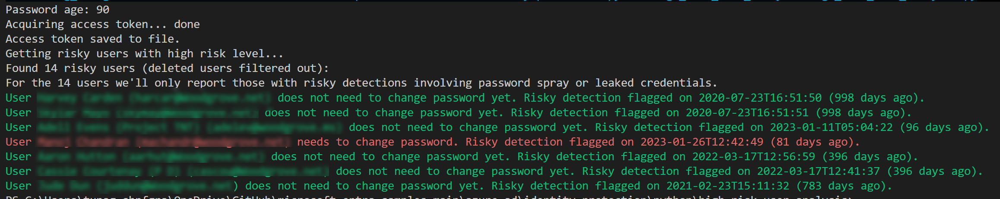

# Azure AD High Risk Users Analysis

## Description

This script retrieves a list of risky users from Azure AD Identity Protection and identifies which ones need to change their passwords based on two risk detections (**Password Spray** and **Leaked Credentials**) in their risk history. It also outputs the list of users who do not need to reset their passwords yet and saves the list of users who do not need to reset their passwords to a file. This file can later be used to source bulk riskyUser: dismiss operation via the risky user API.

## Dependencies and Prerequisites

This script requires the following packages to be installed:

- Python 3.x
- `msal`
- `requests`
- `datetime`
- `re`
- `json`
- `colorama`
- `csv`
- `logging`

You will also need to create an Azure AD app and set up the necessary credentials. See [Microsoft's documentation](https://docs.microsoft.com/en-us/graph/auth-register-app-v2) for more information.

## Installation

1. Clone this repository to your local machine.
2. Install the necessary dependencies using pip: `pip install -r requirements.txt`
3. Set up your Azure AD app credentials in the script.
4. Replace the following variables in the script with your own values:
    - `client_id`: Your Azure AD app client ID.
    - `client_secret`: Your Azure AD app client secret.
    - `tenant_id`: Your Azure AD tenant ID.

## Usage

1. Set the number of days until the user needs to change their password by modifying the `days_since_last_change` variable in `high_risk_user_analysis.py`, the default value is 90, this value can be the max password age defined in your organization.
2. Update the Azure AD app credentials, tenant ID, and MS Graph API settings in `high_risk_user_analysis.py`.
3. Run the script by executing the following command: `python high_risk_user_analysis.py`.
4. The script will output the list of users who need to reset their passwords color coded in the terminal.
5. The script will output the list of users who need to reset their passwords and save the list of users who do not need to reset their passwords yet to a file.
    - access_token.json: contains the access token for the Azure AD app (for fun!)
    - password_reset.csv: contains the list of users who need to reset their passwords (for SOC investigation)
    - no_password_reset.csv: contains the list of users who don't need to reset their passwords (for SOC investigation)
    - risk_history.json: contains the risk history of the users with high risk level (for SOC investigation)
    - dismiss_user.json: contains the list of user IDs who don't need to reset their passwords (for bulk API dismiss operation)

## Disclaimer

This script is provided as-is and without warranty of any kind. Use at your own risk.

## License

This project is licensed under the MIT License - see the LICENSE.md file for details.

## Acknowledgements

- [Microsoft Authentication Library (MSAL) for Python](https://github.com/AzureAD/microsoft-authentication-library-for-python)
- [Microsoft Graph API](https://docs.microsoft.com/en-us/graph/overview)
- [Python Requests library](https://requests.readthedocs.io/en/master/)
- [Python csv module](https://docs.python.org/3/library/csv.html)
- [Python logging module](https://docs.python.org/3/library/logging.html)
- [Colorama: Cross-platform colored terminal text](https://github.com/tartley/colorama)
- [Identity Protection - riskyUser: dismiss](https://learn.microsoft.com/en-us/graph/api/riskyuser-dismiss)
